# Failure Modes Overview

Overview of all failure injection types available in Operator Chaos.

## Quick Reference

| Type | Danger | Description |
|------|--------|-------------|
| [ClientFault](client-fault.md) | :material-shield-check: Low | Injects errors, latency, or throttling into operator API calls via SDK integration. |
| [ConfigDrift](config-drift.md) | :material-shield-check: Low | Modifies a key in a ConfigMap or Secret to test configuration reconciliation. |
| [PodKill](podkill.md) | :material-shield-check: Low | Force-deletes pods matching a label selector with zero grace period. |
| [CRDMutation](crd-mutation.md) | :material-shield-alert: Medium | Mutates a spec field on a custom resource instance to test reconciliation of CR state. |
| [FinalizerBlock](finalizer-block.md) | :material-shield-alert: Medium | Adds a stuck finalizer to a resource to test deletion handling and cleanup logic. |
| [LabelStomping](label-stomping.md) | :material-shield-alert: Medium | Modifies or removes labels on operator-managed resources to test label-based reconciliation. |
| [NetworkPartition](network-partition.md) | :material-shield-alert: Medium | Creates a deny-all NetworkPolicy isolating pods matching a label selector from all ingress and egress traffic. |
| [OwnerRefOrphan](ownerref-orphan.md) | :material-shield-alert: Medium | Removes ownerReferences from operator-managed resources to test re-adoption logic. |
| [QuotaExhaustion](quota-exhaustion.md) | :material-shield-alert: Medium | Creates a restrictive ResourceQuota to test operator behavior under resource pressure. |
| [CrashLoopInject](crashloop-inject.md) | :material-shield-remove: High | Patches a Deployment's container command to a nonexistent binary, causing CrashLoopBackOff. |
| [DeploymentScaleZero](deployment-scale-zero.md) | :material-shield-remove: High | Scales a Deployment to zero replicas to test recovery and replica count reconciliation. |
| [ImageCorrupt](image-corrupt.md) | :material-shield-remove: High | Patches a Deployment's container image to an invalid registry, causing ImagePullBackOff. |
| [LeaderElectionDisrupt](leader-election-disrupt.md) | :material-shield-remove: High | Deletes a Lease object to force leader re-election and test election resilience. |
| [NamespaceDeletion](namespace-deletion.md) | :material-shield-remove: High | Deletes an entire namespace to test whether the operator recreates it and its managed resources. |
| [PDBBlock](pdb-block.md) | :material-shield-remove: High | Creates a PodDisruptionBudget with maxUnavailable=0 to block all voluntary evictions. |
| [RBACRevoke](rbac-revoke.md) | :material-shield-remove: High | Clears all subjects from a ClusterRoleBinding or RoleBinding to test RBAC resilience. |
| [ResourceDeletion](resource-deletion.md) | :material-shield-remove: High | Deletes an arbitrary namespaced resource to test whether the operator recreates it. |
| [SecretDeletion](secret-deletion.md) | :material-shield-remove: High | Deletes a Secret to test whether the operator detects the loss and recreates it. |
| [WebhookDisrupt](webhook-disrupt.md) | :material-shield-remove: High | Modifies failure policies on a ValidatingWebhookConfiguration to test webhook resilience. |
| [WebhookLatency](webhook-latency.md) | :material-shield-remove: High | Deploys a slow admission webhook to add latency to API server requests for specific resources. |

## Decision Tree

Which failure mode should I use?

```mermaid
graph TD
    A[What are you testing?] --> B{Pod lifecycle?}
    B -->|Yes| C[PodKill]
    A --> D{Network resilience?}
    D -->|Yes| E[NetworkPartition]
    A --> F{Config reconciliation?}
    F -->|Yes| G[ConfigDrift]
    A --> H{CR spec handling?}
    H -->|Yes| I[CRDMutation]
    A --> J{Webhook resilience?}
    J -->|Yes| K[WebhookDisrupt]
    A --> L{Permission handling?}
    L -->|Yes| M[RBACRevoke]
    A --> N{Deletion/cleanup?}
    N -->|Yes| O[FinalizerBlock]
    A --> P{API error handling?}
    P -->|Yes| Q[ClientFault]
    A --> R{Ownership/adoption?}
    R -->|Yes| S[OwnerRefOrphan]
    A --> T{Resource pressure?}
    T -->|Yes| U[QuotaExhaustion]
    A --> V{API latency?}
    V -->|Yes| W[WebhookLatency]
    A --> X{Secret resilience?}
    X -->|Yes| Y[SecretDeletion]
    A --> Z{Rollout handling?}
    Z -->|CrashLoopBackOff| AA[CrashLoopInject]
    Z -->|ImagePullBackOff| AB[ImageCorrupt]
    A --> AC{Scale enforcement?}
    AC -->|Yes| AD[DeploymentScaleZero]
    A --> AE{Eviction blocking?}
    AE -->|Yes| AF[PDBBlock]
    A --> AG{Leader election?}
    AG -->|Yes| AH[LeaderElectionDisrupt]
    A --> AI{Resource recreation?}
    AI -->|Yes| AJ[ResourceDeletion]
```

## Coverage by Component

### Active Components (RHOAI 3.x / ODH)

| Component | CRDMut | Client | CfgDrift | Finalizer | LblStomp | NsDel | NetPart | OwnerRef | PodKill | Quota | RBAC | WebhookD | WebhookL | SecDel | ScaleZ | LeaderE | Crash | ImgCorr | ResDel | PDB | Total |
|-----------|:------:|:------:|:--------:|:---------:|:--------:|:-----:|:-------:|:--------:|:-------:|:-----:|:----:|:--------:|:--------:|:------:|:------:|:-------:|:-----:|:-------:|:------:|:---:|:-----:|
| dashboard | :material-check: | - | :material-check: | - | - | - | :material-check: | - | :material-check: | :material-check: | :material-check: | :material-check: | - | - | :material-check: | - | :material-check: | :material-check: | :material-check: | :material-check: | 12 |
| data-science-pipelines | - | - | - | :material-check: | - | - | :material-check: | - | :material-check: | - | :material-check: | :material-check: | - | - | :material-check: | :material-check: | :material-check: | :material-check: | :material-check: | :material-check: | 11 |
| feast | - | - | - | :material-check: | - | - | :material-check: | - | :material-check: | - | :material-check: | - | - | - | :material-check: | :material-check: | :material-check: | :material-check: | :material-check: | :material-check: | 10 |
| kserve | :material-check: | - | :material-check: | - | - | - | :material-check: | :material-check: | :material-check: | - | - | :material-check: | - | - | - | - | :material-check: | :material-check: | :material-check: | :material-check: | 10 |
| llamastack | - | - | :material-check: | - | - | - | :material-check: | - | :material-check: | - | :material-check: | - | - | - | :material-check: | :material-check: | :material-check: | :material-check: | :material-check: | :material-check: | 10 |
| model-registry | :material-check: | - | - | :material-check: | - | - | :material-check: | - | :material-check: | - | :material-check: | :material-check: | - | - | :material-check: | :material-check: | :material-check: | :material-check: | :material-check: | :material-check: | 12 |
| odh-model-controller | :material-check: | :material-check: | :material-check: | :material-check: | :material-check: | :material-check: | :material-check: | :material-check: | :material-check: | :material-check: | :material-check: | :material-check: | :material-check: | - | - | - | :material-check: | :material-check: | :material-check: | :material-check: | 17 |
| opendatahub-operator | - | - | - | :material-check: | - | - | :material-check: | - | :material-check: | - | :material-check: | :material-check: | - | - | - | - | - | - | - | - | 5 |
| ray | - | - | - | :material-check: | - | - | :material-check: | - | :material-check: | - | :material-check: | - | - | - | :material-check: | :material-check: | :material-check: | :material-check: | :material-check: | :material-check: | 10 |
| training-operator | - | - | - | :material-check: | - | - | :material-check: | - | :material-check: | - | :material-check: | - | - | - | :material-check: | - | :material-check: | :material-check: | :material-check: | :material-check: | 9 |
| trustyai | - | - | - | - | - | - | :material-check: | - | :material-check: | - | :material-check: | - | - | - | :material-check: | :material-check: | :material-check: | :material-check: | :material-check: | :material-check: | 9 |
| workbenches | - | - | - | - | - | - | :material-check: | - | :material-check: | - | :material-check: | :material-check: | - | - | :material-check: | - | :material-check: | :material-check: | :material-check: | :material-check: | 9 |

### External Dependencies

| Component | CRDMut | Client | CfgDrift | Finalizer | LblStomp | NsDel | NetPart | OwnerRef | PodKill | Quota | RBAC | WebhookD | WebhookL | SecDel | ScaleZ | LeaderE | Crash | ImgCorr | ResDel | PDB | Total |
|-----------|:------:|:------:|:--------:|:---------:|:--------:|:-----:|:-------:|:--------:|:-------:|:-----:|:----:|:--------:|:--------:|:------:|:------:|:-------:|:-----:|:-------:|:------:|:---:|:-----:|
| cert-manager | - | - | :material-check: | - | :material-check: | - | :material-check: | - | :material-check: | :material-check: | :material-check: | - | - | :material-check: | - | - | :material-check: | :material-check: | :material-check: | :material-check: | 11 |
| knative-serving | - | - | :material-check: | - | :material-check: | - | :material-check: | - | :material-check: | :material-check: | :material-check: | :material-check: | - | - | - | - | :material-check: | :material-check: | :material-check: | :material-check: | 11 |
| service-mesh | :material-check: | - | :material-check: | :material-check: | :material-check: | - | :material-check: | :material-check: | :material-check: | :material-check: | :material-check: | :material-check: | :material-check: | - | - | - | :material-check: | :material-check: | :material-check: | :material-check: | 15 |
| strimzi | - | - | - | - | :material-check: | - | :material-check: | - | :material-check: | - | - | - | - | - | :material-check: | :material-check: | :material-check: | :material-check: | - | :material-check: | 8 |
| spark-operator | - | - | - | - | :material-check: | - | :material-check: | - | :material-check: | - | - | :material-check: | - | - | :material-check: | :material-check: | :material-check: | :material-check: | :material-check: | :material-check: | 10 |
| argocd | - | - | - | - | :material-check: | - | :material-check: | - | :material-check: | - | - | - | - | - | :material-check: | - | :material-check: | :material-check: | :material-check: | :material-check: | 8 |
| tekton | - | - | - | - | - | - | :material-check: | - | :material-check: | - | - | - | - | - | :material-check: | :material-check: | :material-check: | :material-check: | :material-check: | :material-check: | 8 |
| prometheus-operator | - | - | - | - | - | - | :material-check: | - | :material-check: | - | - | - | - | - | :material-check: | - | :material-check: | :material-check: | - | :material-check: | 6 |

### Removed/Replaced (RHOAI 3.x)

Experiments still available for ODH or RHOAI 2.x testing.

| Component | CRDMut | Client | CfgDrift | Finalizer | LblStomp | NsDel | NetPart | OwnerRef | PodKill | Quota | RBAC | WebhookD | WebhookL | SecDel | ScaleZ | LeaderE | Crash | ImgCorr | ResDel | PDB | Total | Status |
|-----------|:------:|:------:|:--------:|:---------:|:--------:|:-----:|:-------:|:--------:|:-------:|:-----:|:----:|:--------:|:--------:|:------:|:------:|:-------:|:-----:|:-------:|:------:|:---:|:-----:|--------|
| codeflare | - | - | :material-check: | - | - | - | :material-check: | - | :material-check: | - | :material-check: | - | - | - | - | - | - | - | - | - | 4 | Removed in 3.0 |
| kueue | - | - | - | :material-check: | - | - | :material-check: | - | :material-check: | - | :material-check: | :material-check: | - | - | - | - | - | - | - | - | 5 | Replaced by RH Kueue |
| modelmesh | - | - | :material-check: | - | - | - | :material-check: | - | :material-check: | - | :material-check: | :material-check: | - | - | - | - | - | - | - | - | 5 | Removed in 3.0 |

<!-- custom-start: notes -->
<!-- custom-end: notes -->
