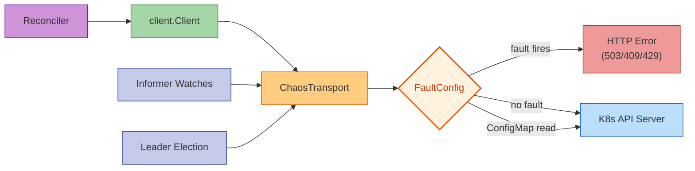

# Transport Mode (chaostransport)

Inject faults at the HTTP transport layer by wrapping `http.RoundTripper` via `rest.Config.WrapTransport`. Unlike [SDK mode](sdk.md) (which wraps `client.Client` and only intercepts CRUD operations), transport mode intercepts **every** HTTP request the operator makes to the API server: informer watches, cache list/gets, leader election lease renewals, health probes, and direct API calls.

!!! tip "When to use Transport mode"
    Use this when you want to test how your operator handles API server failures that affect the full HTTP path (informers, watches, cache), or when your operator has k8s.io dependency versions that are incompatible with the SDK's controller-runtime dependency.



## Why a separate Go module?

The main operator-chaos SDK (`pkg/sdk`) imports `controller-runtime v0.19.7` and `k8s.io/client-go v0.35.x`. Many operators in the Kubernetes ecosystem are pinned to different versions of these libraries. When such an operator tries to `go get` the SDK, Go's Minimum Version Selection (MVS) forces an upgrade of all k8s.io packages, which breaks compilation.

The `chaostransport` sub-module solves this by having **zero external dependencies**:

```
module github.com/opendatahub-io/operator-chaos/pkg/chaostransport

go 1.22.0
```

No controller-runtime. No k8s.io. Only Go standard library (`net/http`, `sync/atomic`, `encoding/json`, `math/rand/v2`).

### Three integration approaches

| Approach | Dependency impact | What you get | When to use |
|----------|------------------|-------------|-------------|
| **chaostransport sub-module** | Zero k8s.io deps | Transport wrapper, ActionInterceptor, fault config types, ConfigMap parser | Default choice for any operator |
| **pkg/sdk/client (ChaosClient)** | Requires controller-runtime v0.19.7+ | client.Client wrapper for CRUD-level injection | When your operator's controller-runtime version is compatible |
| **Inline (~250 lines)** | Zero external deps | Copy transport wrapper into your source tree | When even the sub-module import causes version conflicts |

In our testing, 4 out of 7 operators had dependency conflicts that prevented importing the full SDK. All 7 worked with the chaostransport sub-module. One (trustyai) required the inline approach due to transitive dependency conflicts with kserve v0.12.1 and kueue v0.6.2 types.

## Prerequisites

- Go 1.22+
- Access to your operator's `main()` or setup function where `rest.Config` is created

No controller-runtime version requirement. No k8s.io version requirement.

## Step-by-Step Walkthrough

### Step 1: Import chaostransport

```bash
go get github.com/opendatahub-io/operator-chaos/pkg/chaostransport
```

### Step 2: Wrap the HTTP transport

Add three lines to your operator's `main()`, before `ctrl.NewManager()`:

```go
import "github.com/opendatahub-io/operator-chaos/pkg/chaostransport"

cfg := ctrl.GetConfigOrDie()

// Gate behind an env var so it's disabled by default
if os.Getenv("CHAOS_SDK_ENABLED") == "true" {
    ct := chaostransport.NewChaosTransport(chaostransport.NewFaultConfig(nil))
    cfg.WrapTransport = ct.WrapTransport
}

mgr, err := ctrl.NewManager(cfg, ctrl.Options{...})
```

The `ChaosTransport` wraps any `http.RoundTripper`. When no faults are configured, it passes all requests through with zero overhead.

### Step 3: Add a ConfigMap watcher (optional)

The chaostransport module provides `ParseFaultConfigFromData` to parse fault configuration from a ConfigMap's data map. You implement a simple watcher goroutine that reads the ConfigMap periodically and calls `UpdateFaultConfig`:

```go
func watchChaosConfig(cfg *rest.Config, ct *chaostransport.ChaosTransport) {
    clientset, _ := kubernetes.NewForConfig(cfg)
    ticker := time.NewTicker(10 * time.Second)
    defer ticker.Stop()

    for range ticker.C {
        cm, err := clientset.CoreV1().ConfigMaps("my-namespace").Get(
            context.Background(), chaostransport.ChaosConfigMapName, metav1.GetOptions{})
        if err != nil {
            ct.UpdateFaultConfig(chaostransport.NewFaultConfig(nil))
            continue
        }
        fc, _ := chaostransport.ParseFaultConfigFromData(cm.Data)
        ct.UpdateFaultConfig(fc)
    }
}
```

Start it as a goroutine after creating the ChaosTransport:

```go
if os.Getenv("CHAOS_SDK_ENABLED") == "true" {
    ct := chaostransport.NewChaosTransport(chaostransport.NewFaultConfig(nil))
    cfg.WrapTransport = ct.WrapTransport
    go watchChaosConfig(cfg, ct)
}
```

### Step 4: Deploy and inject faults

Deploy the instrumented operator, wait for steady state, then apply a ConfigMap:

```yaml
apiVersion: v1
kind: ConfigMap
metadata:
  name: operator-chaos-config
  namespace: my-namespace
data:
  config: |
    {
      "active": true,
      "faults": {
        "update": {"errorRate": 0.4, "error": "chaos conflict"},
        "patch":  {"errorRate": 0.4, "error": "chaos SSA conflict"},
        "create": {"errorRate": 0.2, "error": "chaos already exists"}
      }
    }
```

The watcher picks it up within 10 seconds. To disable, delete the ConfigMap or set `"active": false`.

## How it works

The `ChaosTransport` wraps the inner `http.RoundTripper` and checks every outbound HTTP request against the current `FaultConfig`:

1. If faults are inactive or the config is nil, pass through to the real API server
2. If the request is a ConfigMap read for the chaos config, pass through (the watcher must always reach the API server)
3. Map the HTTP method to an operation (GET -> OpGet, PUT -> OpUpdate, POST -> OpCreate, etc.)
4. Call `MaybeInject(op)` which rolls against the error rate
5. If the fault fires, return an HTTP error response without reaching the API server
6. If not, pass through to the real API server

Error codes are semantically correct for each operation:

| Operation | HTTP Status | Reason |
|-----------|------------|--------|
| GET / LIST | 503 Service Unavailable | Simulates API server unavailability |
| POST (Create) | 429 Too Many Requests | Simulates rate limiting |
| PUT / PATCH (Update) | 409 Conflict | Simulates write conflicts |
| DELETE | 403 Forbidden | Simulates permission errors |

## ActionInterceptor

The chaostransport module also includes an `ActionInterceptor` for per-action fault injection in reconciler pipelines. Instead of failing all Updates, you can target specific actions:

```go
interceptor := chaostransport.NewActionInterceptor(map[string]chaostransport.ActionFaultConfig{
    "deploy": {
        FailBefore: "simulated deploy failure",
        ErrorRate:  0.5,
    },
    "gc": {
        Skip: true,  // always skip garbage collection
    },
})

// Wrap your action functions:
deployAction = interceptor.Wrap("deploy", deployAction)
```

Four fault behaviors: **Skip** (no-op), **FailBefore** (error before action runs), **FailAfter** (run action then error), **Delay** (add latency).

## Transport vs SDK vs CLI

| Aspect | Transport (chaostransport) | SDK (ChaosClient) | CLI (ChaosExperiment) |
|--------|--------------------------|--------------------|-----------------------|
| Intercepts informers | Yes | No | N/A (external) |
| Intercepts CRUD | Yes | Yes | N/A (external) |
| Intercepts leader election | Yes | No | N/A (external) |
| Dependencies | Zero | controller-runtime | None (binary) |
| Code changes | 3 lines | ~5 lines | None |
| Per-operation targeting | No (all HTTP) | Yes (per CRUD op) | N/A |
| Live cluster required | Yes | No (fake client ok) | Yes |

## Next Steps

- Use [SDK mode](sdk.md) for targeted CRUD-level injection in integration tests
- Use [Fuzz mode](fuzz.md) for offline reconciler testing with random faults
- Use [CLI mode](cli.md) for full experiment lifecycle on a live cluster
